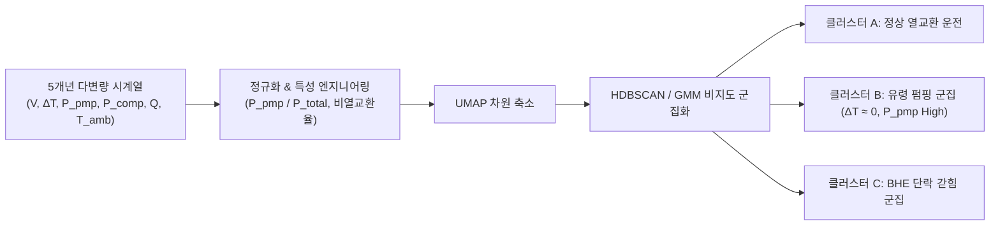
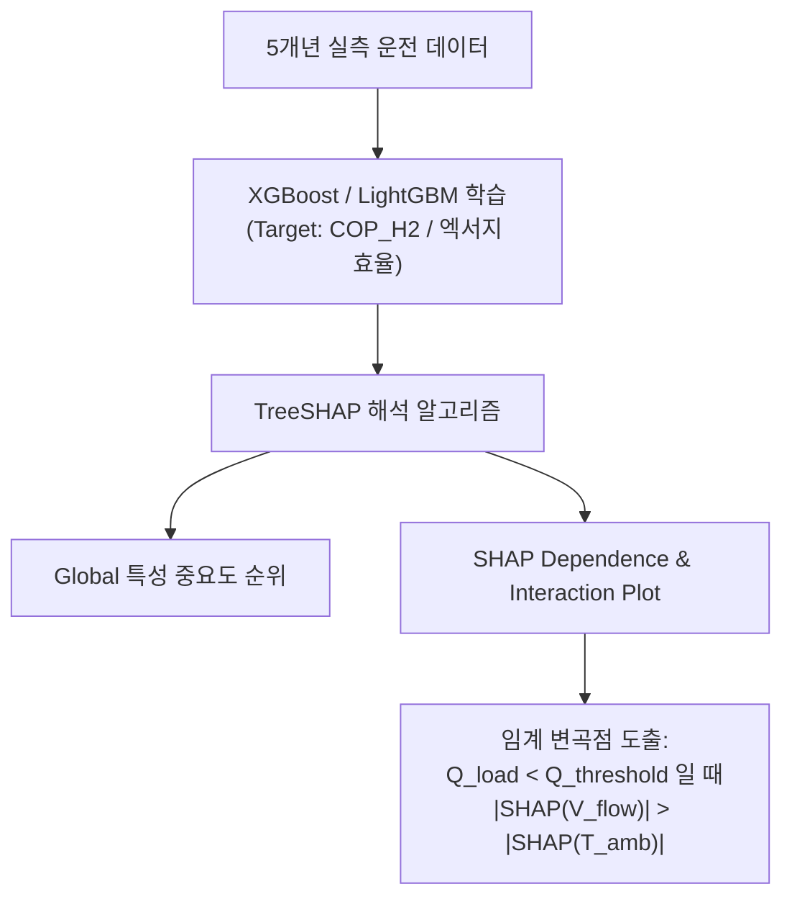
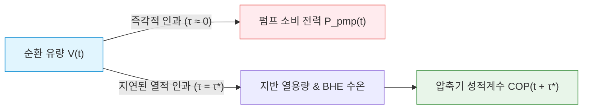

# IEA Annex 52 실측 빅데이터 기반 GSHP 고급 데이터 분석 주제 4선

본 문서는 **스웨덴 스톡홀름 대학교 Studenthuset의 5개년(60개월) 장기 실측 다변량 시계열 데이터**를 기반으로, 단순 엔지니어링 수식 검증을 넘어 데이터 과학(Data Science) 및 머신러닝 기법을 통해 **기존 이론과 매뉴얼에서 관측되지 않았던 숨겨진 물리적·수력학적 거동을 발굴(Discovery)**하기 위한 심층 데이터 분석 주제 4가지를 정의합니다.

---

## 📌 분석 대상 데이터 개요 (Context & Data Scope)
* **대상 시스템**: 스톡홀름 대학교 Studenthuset (연면적 $6,300\text{ m}^2$, 20개 BHE, 5대 40kW HP, 다이렉트 프리쿨링)
* **데이터 규모**: 2016년 1월 ~ 2020년 12월 (60개월간의 시간별/월별 다변량 시계열)
* **핵심 입력 변수군**:
  - 지중 루프: 유입/유출 수온 ($T_{in}, T_{out}$), 순환 유량 ($\dot{V}$), 온도차 ($\Delta T$), 지중 열교환량 ($Q_{source}$)
  - 전력 서브미터링: 히트펌프 압축기 소비 전력 ($P_{comp}$), 지중 순환 펌프 소비 전력 ($P_{pmp, src}$), 부하 펌프 전력 ($P_{pmp, load}$)
  - 부하 및 환경: 공간 난방 부하 ($Q_{heat}$), 직접 냉방 열량 ($Q_{cool, dir}$), 급탕 ($Q_{dhw}$), 외기 건구온도 ($T_{amb}$)
  - 성능 지표: 순시 성적계수 ($\text{COP}$), 계절 성능계수 ($\text{SPF}_{H1}, \text{SPF}_{H2}, \text{SPF}_{C2}$), 비펌핑 동력 ($W/\text{ton}$)

---

## 🔬 주제 1: 비지도 학습 기반 고차원 클러스터링을 통한 "유령 펌핑(Phantom Pumping) 및 잠재 비효율 레짐" 발굴

### 1. 핵심 질문 및 문제의식
> "설계 매뉴얼에는 냉방·난방·프리쿨링 3개 모드만 정의되어 있으나, 실제 5년간의 고차원 데이터 공간 속에 관리자가 인지하지 못한 **에너지 누수형 잠재 운전 패턴(Latent Inefficient Regimes)**이 얼마나 숨겨져 있는가?"

### 2. 데이터 분석 방법론 및 파이프라인
* **차원 축소 (Dimensionality Reduction)**:
  - 다차원 시계열 벡터 $[\dot{V}, \Delta T, P_{pmp}, P_{comp}, Q_{total}, T_{amb}, \frac{P_{pmp}}{P_{total}}]$ 정규화 후 **t-SNE** 및 **UMAP**을 적용하여 2D/3D 매니폴드 공간으로 투영.
* **밀도 기반 및 혼합 군집화 (Clustering)**:
  - **HDBSCAN** (계층적 밀도 기반 군집화) 및 **Gaussian Mixture Models (GMM)**을 적용하여 정상 운전 클러스터와 노이즈/비정상 클러스터를 자동 분리.
* **군집별 특성 프로파일링**:
  - 각 클러스터의 중심점(Centroid)과 분산, 평균 열교환 효율 및 펌프/압축기 전력비 분석.

### 3. 데이터에서 발굴할 새로운 인사이트 (Discovery)
1. **유령 펌핑(Phantom Pumping) 군집 정량화**:
   - 실질적인 건물 열교환은 거의 일어나지 않으면서($\Delta T < 0.5\text{ K}$, $Q \approx 0$) 순환 펌프만 고전력으로 헛도는 '유령 운전 상태'의 발생 빈도, 시간대(주로 야간/중간기), 누적 전력 낭비량($\text{kWh}$)을 데이터로 적나라하게 규명.
2. **보어홀 단락(Short-circuiting) 갇힘 군집 포착**:
   - 지중으로 열이 전달되지 않고 U-tube 내부에서만 열이 순환되어 입출구 수온차가 급감하는 과도 상태 군집을 통계적으로 분리 및 식별.

---

## 🔬 주제 2: XAI(설명 가능한 AI) & SHAP 분석 기반 "효율 저하 인자 역전 임계 변곡점" 탐색

### 1. 핵심 질문 및 문제의식
> "시스템 COP/SPF를 결정하는 1순위 인자는 상식적으로 '외기온도'나 '건물 부하'로 알려져 있다. 하지만 **어떤 특정 운전 조건(임계점)에 도달하면 순환 펌프 유량($\dot{V}$)의 과다가 외기온을 제치고 시스템 효율을 갉아먹는 최대 악영향 인자로 역전(Phase Change)되는가?**"

### 2. 데이터 분석 방법론 및 파이프라인
* **비선형 머신러닝 회귀 모델 구축**:
  - 타겟 변수: 시스템 종합 효율 ($\text{COP}_{H2}$ 또는 엑서지 효율 $\eta_{ex}$)
  - 입력 피처: $[\dot{V}_{source}, T_{amb}, Q_{load}, T_{in}, T_{out}, \Delta T, P_{comp}]$
  - 알고리즘: **XGBoost** 및 **LightGBM** (하이퍼파라미터 베이지안 최적화 적용).
* **SHAP (Shapley Additive exPlanations) 해석**:
  - 각 운전 시점별 피처 기여도(SHAP Value) 계산.
  - **SHAP 의존성 플롯 (SHAP Dependence Plot)** 및 **특성 상호작용(Interaction Values)** 도출.

### 3. 데이터에서 발굴할 새로운 인사이트 (Discovery)
1. **특성 중요도 상전이(Phase Change) 임계점 도출**:
   - 부하율이 특정 임계값($Q_{load} < Q_{crit}$) 이하로 떨어지는 부분 부하 구간에서, **지중 유량($\dot{V}$)의 음(-)의 SHAP 값이 외기온($T_{amb}$)의 기여도를 추월하는 물리적 전이점(Tipping Point)**을 수치 좌표로 특정.
2. **비선형 상호작용 효과 시각화**:
   - 동일한 외기온 조건이라도 순환 유량에 따라 효율이 급락하는 비선형적 패널티 구조를 실측 데이터 기반 곡선으로 증명.

---

## 🔬 주제 3: 상태 공간 궤적(Phase Space Trajectory)을 통한 "열역학-수력학 히스테리시스 루프" 규명

### 1. 핵심 질문 및 문제의식
> "정상상태 이론에서는 부하 증가기($Q \uparrow$)와 감소기($Q \downarrow$)의 거동이 대칭적이라고 가정한다. 그러나 **지반의 거대한 열용량과 펌프 제어 지연으로 인해 실제로 데이터가 그리는 상태 궤적은 얼마나 비대칭적인 폐곡선(Hysteresis Loop)을 형성하며, 이 루프가 의미하는 동적 에너지 손실은 얼마인가?**"

### 2. 데이터 분석 방법론 및 파이프라인
* **위상 공간 재구성 (Phase Space Reconstruction)**:
  - 3차원 상태 좌표계 정의:
    - $\text{X축: 지중 순환 유량 } \dot{V}_{source}$
    - $\text{Y축: 보어홀 입출구 수온차 } \Delta T_{source}$
    - $\text{Z축: 종합 소비 전력 } P_{total} = P_{comp} + P_{pmp}$
* **동적 히스테리시스 폐곡선 적분 (Loop Integration)**:
  - 24시간 일주기(Diurnal Cycle) 및 계절 전환기별 궤적을 폐곡선 형태로 파싱.
  - 그린 정리(Green's Theorem)를 활용한 위상 루프 면적($\oint P \cdot d\dot{V}$ 또는 $\oint \Delta T \cdot dQ$) 수치 적분.

### 3. 데이터에서 발굴할 새로운 인사이트 (Discovery)
1. **열적-수력학적 히스테리시스 면적(Hysteresis Area) 정량화**:
   - 부하가 꺼진 후에도 지반 열용량 방열 지연과 순환 펌프 지속 가동으로 인해 되돌아오는 궤적이 크게 벌어지는 '동적 에너지 지연 손실'의 크기를 루프 면적으로 정량화.
2. **운전 모드별(냉방 vs 난방) 궤적 변형도 비교**:
   - 부동액 점도가 높은 동절기 난방 모드와 점도가 낮고 지중 직냉방을 수행하는 하절기 냉방 모드 간의 상태 궤적 복원 탄력성(Elasticity) 차이를 데이터로 규명.

---

## 🔬 주제 4: 전이 엔트로피(Transfer Entropy) 기반 "비선형 인과성 및 지연 시간(Time Lag) 네트워크" 분석

### 1. 핵심 질문 및 문제의식
> "순환수 유량($\dot{V}$)을 조절했을 때 펌프 전력은 1초 만에 바뀌지만, 지반 열용량을 거쳐 **압축기 성능(COP)에 도달하는 유의미한 영향력은 정확히 몇 시간(또는 며칠)의 시간 지연(Lag Time)을 가지며, 정보 흐름(Information Flow)의 크기는 얼마인가?**"

### 2. 데이터 분석 방법론 및 파이프라인
* **정보이론 기반 인과성 검정 (Causal Discovery)**:
  - 단순 선형 상관계수(Correlation)나 정규분포 가정이 필요한 Granger Causality의 한계를 극복하기 위해, 비모수적 **전이 엔트로피 (Transfer Entropy, TE)** 및 **PCMCI 알고리즘** 적용.
* **시간차 파라미터 스윕 ($\tau$-Sweep)**:
  - 시차 $\tau = 1\text{h}, 2\text{h}, \dots, 72\text{h}$ 범위에서 지중 유량($\dot{V}$)에서 시스템 성적계수($\text{COP}$)로의 방향성 정보 전달량 계산:
    $$TE_{X \rightarrow Y}(\tau) = \sum p(y_{t+\tau}, y_t, x_t) \log \frac{p(y_{t+\tau} \mid y_t, x_t)}{p(y_{t+\tau} \mid y_t)}$$

### 3. 데이터에서 발굴할 새로운 인사이트 (Discovery)
1. **지열 시스템 고유의 열역학적 시상수(Dynamic Time Constant) 도출**:
   - $TE(\dot{V} \rightarrow \text{COP})$ 함수가 극댓값을 갖는 임계 시차 $\tau^*$를 규명함으로써, **"현재 시점의 유량 제어가 몇 시간 뒤의 히트펌프 열역학 성능에 가장 강한 영향을 미치는지"**를 실제 5개년 데이터로부터 통계적 인과성으로 도출.
2. **최적 제어(MPC)의 시간 지평(Prediction Horizon) 설계 기준 제시**:
   - 지열 히트펌프의 유량 제어 시 즉각적 펌프 동력 절감과 지연된 열원 수온 변화 사이의 시간차를 고려한 제어 시간 지평의 수학적 가이드라인 제공.

---

## 📊 종합 비교 및 기대 학술 기여도

| 주제 | 핵심 분석 기법 | 주요 분석 대상 변수 | 발굴되는 새로운 지식 (Insight) |
| :--- | :--- | :--- | :--- |
| **주제 1** | t-SNE/UMAP + HDBSCAN | $\dot{V}, \Delta T, P_{pmp}, P_{comp}, Q$ | 비가시적 에너지 누수 상태인 **"유령 펌핑 군집"** 및 **"BHE 단락 갇힘 군집"** 식별 |
| **주제 2** | XGBoost + TreeSHAP | $\text{COP}_{H2}, \dot{V}, T_{amb}, Q_{load}$ | 부하 감소 시 펌프 유량이 효율 저하 1순위 인자로 전환되는 **"특성 중요도 역전 임계점"** |
| **주제 3** | Phase Plane + Loop Integral | $\dot{V}, \Delta T, P_{total}, Q$ | 부하 변동에 따른 지반 열관성 및 펌프 제어 지연이 만드는 **"동적 히스테리시스 손실 면적"** |
| **주제 4** | Transfer Entropy / PCMCI | $\dot{V}_t \rightarrow \text{COP}_{t+\tau}, P_{pmp}$ | 유량 제어 신호가 지반을 거쳐 압축기에 도달하는 **"임계 지연 시간($\tau^*$) 및 인과 경로"** |

> [!TIP]
> **연구 논문 전개 제안**:
> 위 4가지 주제는 단순 모델 검증 논문과 완전히 궤를 달리하며, **"지열 수력학(Geothermal Hydraulics) × 데이터 사이언스(Data Science)"**의 융합 연구로서 저널(Applied Energy, Energy and Buildings, Building and Environment 등)이나 최상위 학회(BS2027)에서 매우 높은 독창성과 인용도를 인정받을 수 있습니다.
